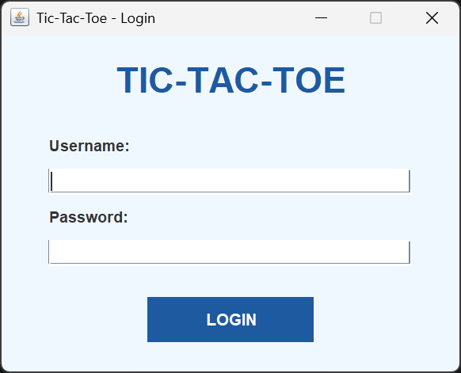
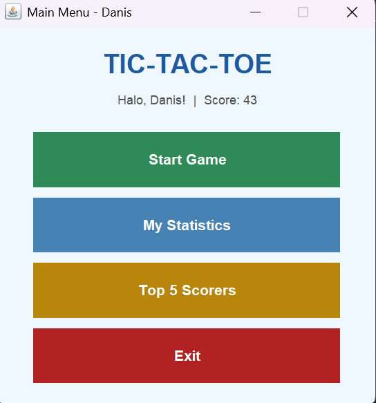
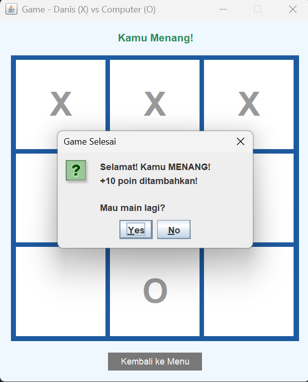
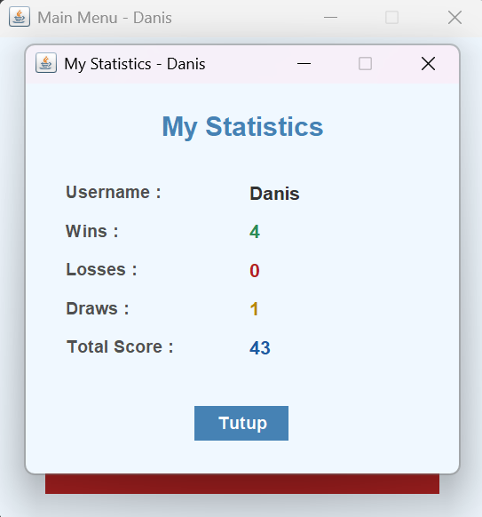
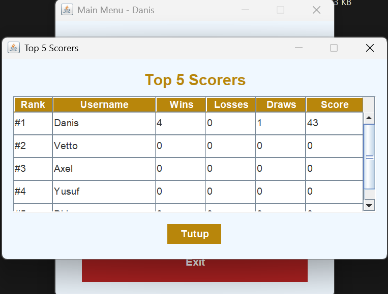

# Small Projects Dasar Pemrograman 2026

## Identitas Mahasiswa

Daniswara Asyam Rahmada - 5026251215 - Dasar Pemrograman - E

# Aplikasi Game Tic-Tac-Toe Sederhana dengan Java Swing, Login, dan Statistik
---

## Deskripsi Project

Project ini adalah aplikasi game **Tic-Tac-Toe** sederhana yang dibangun menggunakan **Java Swing** sebagai antarmuka grafis (GUI). Aplikasi ini mengharuskan pengguna untuk login terlebih dahulu sebelum dapat bermain. Setiap hasil permainan akan dicatat ke dalam database MySQL, dan pemain dapat melihat statistik pribadi mereka serta daftar 5 pemain dengan skor tertinggi.

Game dimainkan di papan berukuran 3×3. Pemain menggunakan simbol **X** dan komputer menggunakan simbol **O**. Pemain menang jika berhasil menempatkan tiga simbol dalam satu baris, kolom, atau diagonal yang sama. Jika semua sel terisi tanpa ada pemenang, permainan berakhir seri.

---

## Fitur Aplikasi

- 🔐 **Login menggunakan database** — pengguna login dengan username dan password yang divalidasi dari database
- 🎮 **Bermain Tic-Tac-Toe menggunakan Swing GUI** — papan 3×3 interaktif menggunakan komponen JButton
- 📊 **Pencatatan wins, losses, draws, dan score** — statistik otomatis tersimpan ke database setiap game selesai
- 👤 **Tampilan statistik pribadi** — pemain dapat melihat data statistik miliknya sendiri
- 🏆 **Tampilan Top 5 Scorer menggunakan JTable** — data diambil langsung dari database

---

## Database

Database yang digunakan: **MySQL**

- Nama database: `game_project`
- Jumlah tabel: **1 tabel** (sesuai ketentuan)

### Struktur Tabel: `players`

| Kolom | Tipe | Keterangan |
|---|---|---|
| id | INT, AUTO_INCREMENT, PK | ID unik pemain |
| username | VARCHAR(50), UNIQUE | Username pemain |
| password | VARCHAR(100) | Password pemain |
| wins | INT, DEFAULT 0 | Jumlah kemenangan |
| losses | INT, DEFAULT 0 | Jumlah kekalahan |
| draws | INT, DEFAULT 0 | Jumlah seri |
| score | INT, DEFAULT 0 | Total skor |

### Sistem Penilaian Skor

| Hasil | Poin |
|---|---|
| Menang | +10 |
| Seri | +3 |
| Kalah | +0 |

---

## Cara Membuat Database

1. Pastikan MySQL sudah berjalan (misalnya lewat XAMPP)
2. Buka phpMyAdmin atau MySQL Workbench
3. Jalankan file `database/schema.sql`, atau salin dan jalankan SQL berikut:

```sql
CREATE DATABASE game_project;
USE game_project;

CREATE TABLE players (
    id       INT AUTO_INCREMENT PRIMARY KEY,
    username VARCHAR(50)  NOT NULL UNIQUE,
    password VARCHAR(100) NOT NULL,
    wins     INT DEFAULT 0,
    losses   INT DEFAULT 0,
    draws    INT DEFAULT 0,
    score    INT DEFAULT 0
);

INSERT INTO players (username, password, wins, losses, draws, score) VALUES
('student1', '12345', 0, 0, 0, 0),
('student2', '12345', 0, 0, 0, 0),
('student3', '12345', 0, 0, 0, 0),
('student4', '12345', 0, 0, 0, 0),
('student5', '12345', 0, 0, 0, 0);
```

---

## Cara Menjalankan Program

1. Buat database menggunakan langkah di atas
2. Import `schema.sql` ke dalam database
3. Buka project Java di IntelliJ IDEA atau NetBeans
4. Tambahkan JDBC driver ke project:
   - Download `mysql-connector-j-x.x.x.jar` dari [dev.mysql.com](https://dev.mysql.com/downloads/connector/j/)
   - IntelliJ: `File → Project Structure → Libraries → tambah JAR`
5. Buka `DatabaseManager.java` dan sesuaikan konfigurasi database:
   ```java
   private static final String URL      = "jdbc:mysql://localhost:3306/game_project";
   private static final String USER     = "root";
   private static final String PASSWORD = ""; // isi password MySQL kamu jika ada
   ```
6. Jalankan `Main.java`

**Akun default untuk login:**
- Username: `student1` | Password: `12345`

---

## Penjelasan Class

**Main:**
Class utama yang menjadi titik awal program. Bertugas membuka LoginFrame saat aplikasi dijalankan menggunakan `SwingUtilities.invokeLater()`.

**DatabaseManager:**
Mengelola koneksi JDBC ke database MySQL. Menyimpan konfigurasi URL, username, dan password database, serta menyediakan method `getConnection()` yang digunakan oleh class lain.

**Player:**
Class model yang menyimpan data pemain, yaitu id, username, wins, losses, draws, dan score. Berisi constructor dan getter untuk setiap field.

**PlayerService:**
Menangani seluruh operasi database, meliputi: validasi login (`login()`), pembaruan statistik setelah game selesai (`updateStatistics()`), pengambilan data pemain terbaru (`getPlayerById()`), dan pengambilan Top 5 skor tertinggi (`getTopFiveScorers()`).

**GameLogic:**
Menangani seluruh logika permainan, meliputi: validasi dan eksekusi gerakan (`makeMove()`), pengecekan pemenang berdasarkan 8 pola kemungkinan (`checkWinner()`), pengecekan kondisi seri (`isDraw()`), dan pembuatan gerakan komputer secara acak (`computerMove()`).

**LoginFrame:**
Window Swing untuk proses login. Berisi field input username dan password, serta tombol login dengan event handling yang memanggil `PlayerService.login()` dan membuka MainMenuFrame jika berhasil.

**MainMenuFrame:**
Window Swing untuk menu utama setelah login berhasil. Berisi tombol navigasi menuju GameFrame, StatisticsFrame, TopScorersFrame, dan tombol Exit.

**GameFrame:**
Window Swing untuk bermain game. Menampilkan papan 3×3 berupa grid JButton yang dihubungkan ke GameLogic. Setelah game selesai, memanggil `PlayerService.updateStatistics()` untuk menyimpan hasil ke database.

**StatisticsFrame:**
Window Swing yang menampilkan statistik pribadi pemain yang sedang login, yaitu wins, losses, draws, dan score. Data diambil langsung dari database agar selalu menampilkan data terbaru.

**TopScorersFrame:**
Window Swing yang menampilkan 5 pemain dengan skor tertinggi menggunakan komponen JTable. Data diambil dari database dengan query `ORDER BY score DESC, wins DESC LIMIT 5`.

---

## Screenshots

### Login Window


### Main Menu


### Game Window


### My Statistics


### Top 5 Scorers


---

## Link Video

YouTube: [https://youtu.be/XXXXXXXX](https://youtu.be/XXXXXXXX)

---

## Link Repository

GitHub: [https://github.com/Danisganteng12/ES234211-swing-game-project](https://github.com/Danisganteng12/ES234211-swing-game-project)
